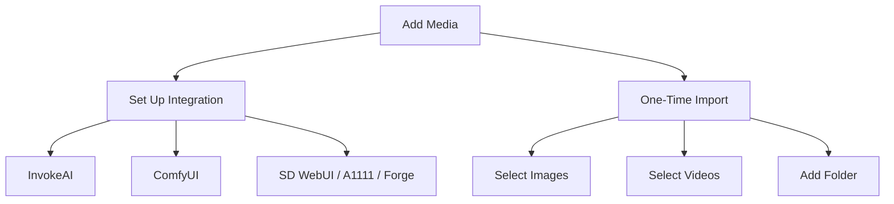

# Adding Folders

[Back to manual index](index.md)

Ambit builds its library by scanning local image folders and selected files. It catalogs supported image files, accepts supported videos through manual selection, and keeps the original files on disk.

## Import Choices

When Ambit asks you to add media, you can choose between integration setup and one-time import.

Use integrations when you want Ambit to understand an existing generator workspace. Use one-time import for downloaded packs, screenshots, archives, or individual files.

Manual video import accepts MP4, WebM, MOV, M4V, and MKV candidates. Ambit probes the file before adding it, shows a static poster in the library, and uses actual playback events to decide whether the built-in viewer can play it. If the current Windows media runtime cannot decode it, the video stays manageable and can be opened in the default app. Folder monitoring and Live Watch remain image-only in this phase.

## Monitored Image Folders

Open Settings > Connections > Folders to manage image folders.

In the Folders section you can:

- add folders containing AI-generated images
- review folders Ambit is monitoring
- rescan a single folder
- refresh metadata across all folders
- remove a folder from Ambit's monitored list

Adding a folder catalogs the files. It does not move or delete your source files.

## Generator Integrations

Ambit has connection pages for common local generator tools:

- InvokeAI: select the root folder containing `databases/invokeai.db`, then test the connection.
- ComfyUI: select the output folder where ComfyUI saves generated images, then link it.
- SD WebUI: select an installation or archive path, scan for output folders, choose folders, then link and import them.

For SD WebUI style folders, Ambit can auto-detect variants such as A1111, Forge, SD.Next, and Anapnoe. If auto-detection is uncertain, select the installation type manually before scanning.

For step-by-step setup and sync behavior, see [Generator Integrations](generator-integrations.md).

## Resource Folders

Resource folders are managed separately from image folders. Open Settings > Connections > Resources to add model, LoRA, embedding, ControlNet, or IP-Adapter folders. Resource folders build a local asset inventory; they do not import images.

For details, see [Assets And Resource Discovery](assets-resource-discovery.md).

## During Scans

Scans can take time on large folders. Ambit reports progress while it scans sources, imports images, and finalizes metadata. If an import is cancelled, imported images are kept and unfinished folders can be rescanned later.

## Next Step

After images appear, continue with [Browsing The Library](browsing-library.md).
